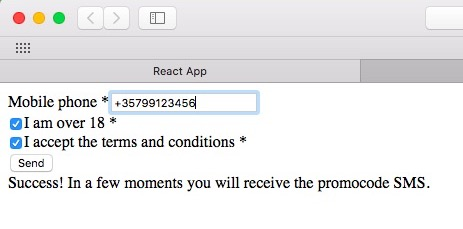
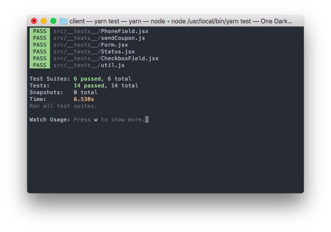

# Bonus Coupon - A React-Express-Twilio project



## Install
```
git clone https://github.com/gregartemides/bonus-coupon.git
cd bonus-coupon
yarn
```

## Twilio credentials
You will need to rename `server/.env.example` to `server/.env` and add your Twilio account credentials and phone number.

## Run
The project can be run from the root directory. This will run the server at http://localhost:3001, and the client at http://localhost:3000 concurrently.
You may also cd into either `client` or `server` directories and run each app independently.
```
yarn start
```

## Tests

There are tests in both client and server. Just cd into either directory and
```
yarn test
```

## License

[MIT](LICENSE)
